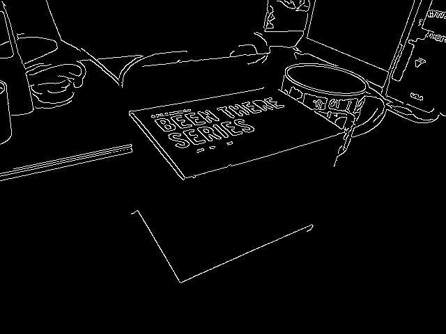
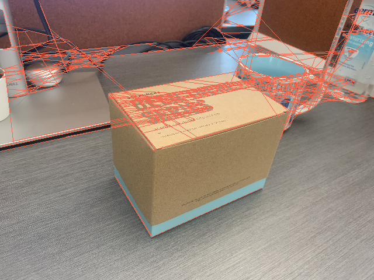
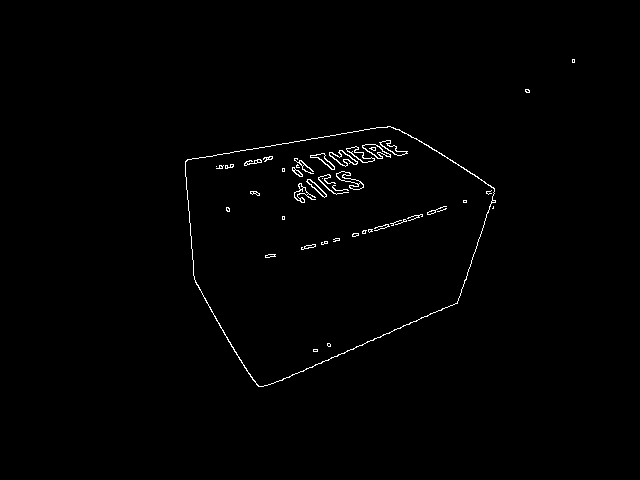
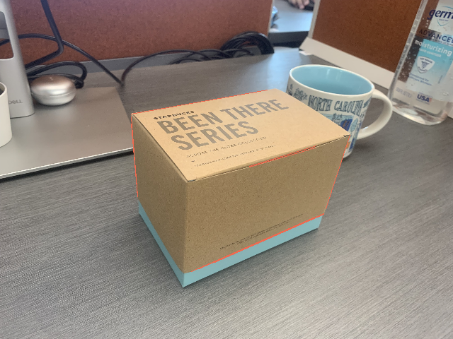

# ECE558_project3_option2
## Problem description
This project focuses on improving the implementation of the paper “single view metrology” (Criminisi, Reid and Zisserman, ICCV99). It substitutes the manual annotation of vanishing points with a detection algorithm based on a line segment
detector (http://www.ipol.im/pub/art/2012/gjmr-lsd/ ) and the RANSAC algorithm. You are encouraged to explore other methods of detecting vanishing points automatically.

## Installation
```
pip install -r requirements.txt
```

## Step 1. Image acquisition.
Take a photo by yourself following the guide of 3-point perspective image as input.


## Step 2.1 Line segment detection.
Canny and HoughLine transformation are applied for line detection and transformation.
'Canny edge detection'

'HoughLine Transformation'


However, the baskground introduces a lot of noisy lines. To reduce the influence of the background, a mask is applied to filter colors in a given range. 
'Default color mask'

The results of canny and Hough line are much better dur to the mask.
'Canny edge detection'

'HoughLine Transformation'


An interface is wriiten for self-adjust the color mask.

