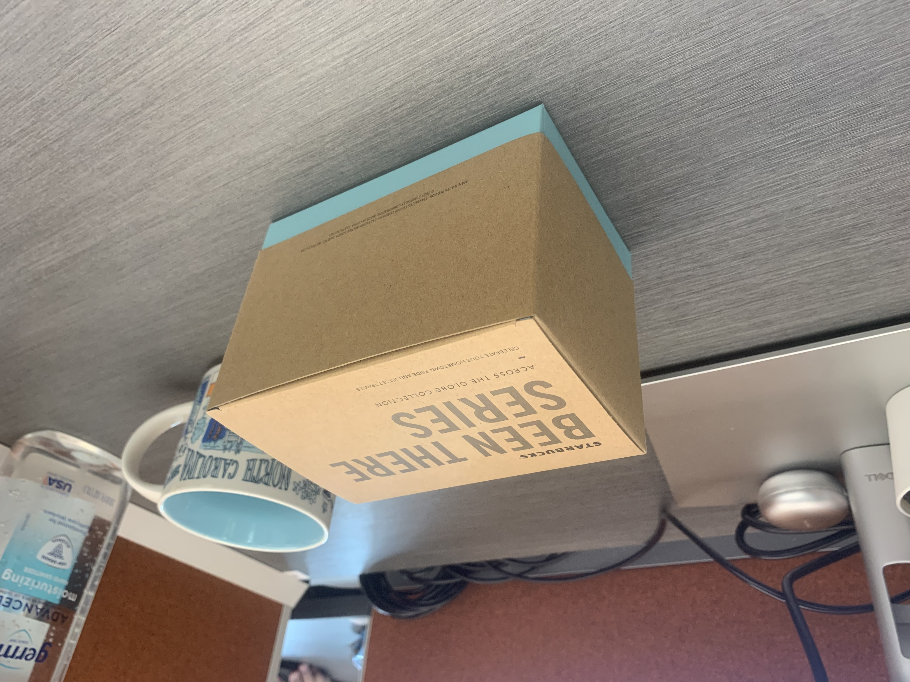

# ECE558_project3_option2
## Problem description
This project focuses on improving the implementation of the paper “single view metrology” (Criminisi, Reid and Zisserman, ICCV99). It substitutes the manual annotation of vanishing points with a detection algorithm based on a line segment
detector (http://www.ipol.im/pub/art/2012/gjmr-lsd/ ) and the RANSAC algorithm. You are encouraged to explore other methods of detecting vanishing points automatically.

## Installation
```
pip install -r requirements.txt
```

## Step 1. Image acquisition.
Take a photo by yourself following the guide of 3-point perspective image as input.

